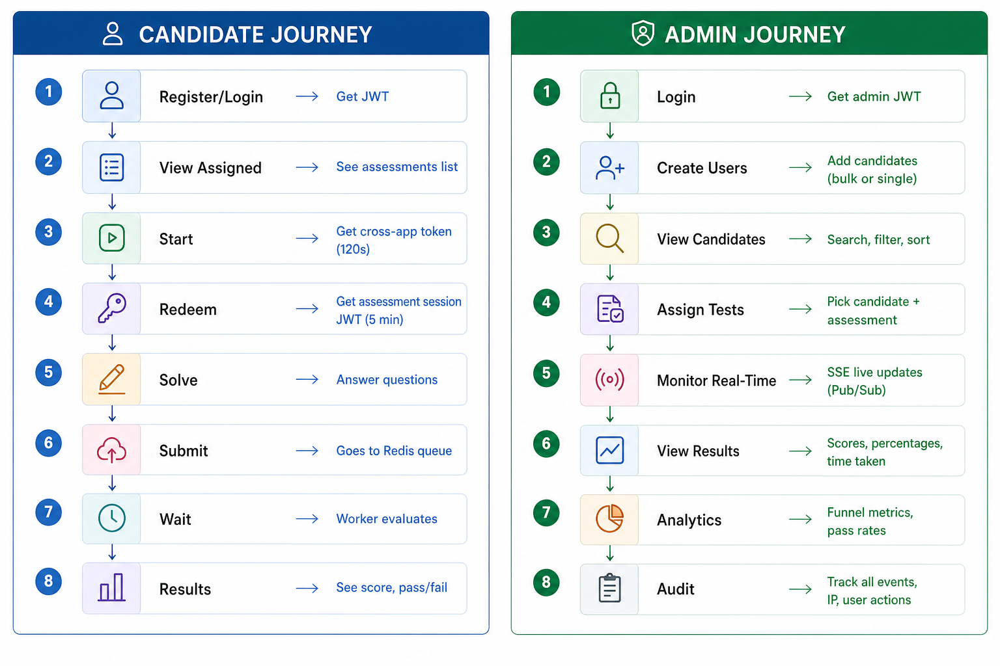
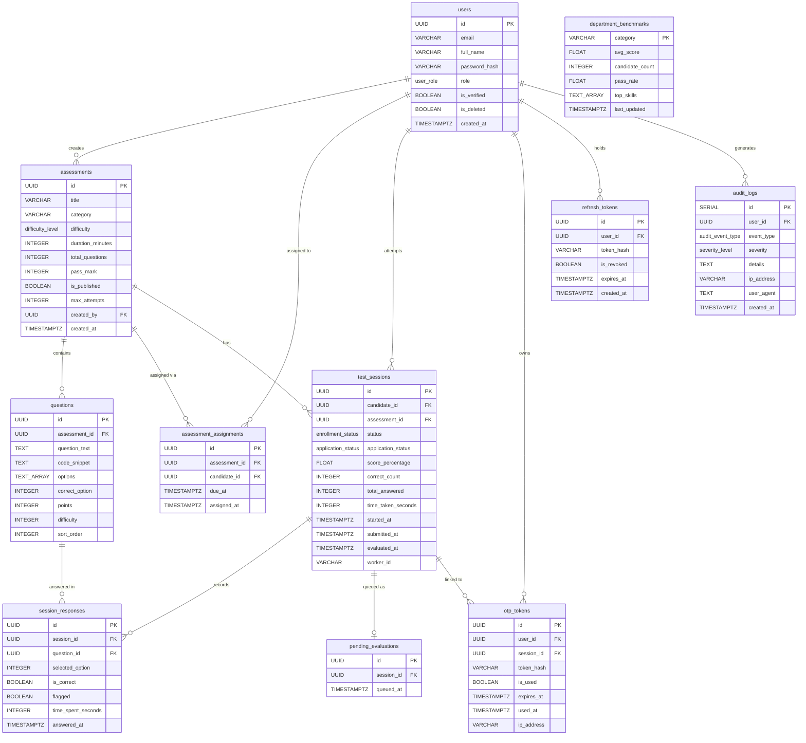

# Assessly — Distributed Candidate Evaluation Platform

A production-grade distributed platform for real-time candidate assessments, built as a monorepo with FastAPI (Python), Next.js, Neon PostgreSQL, and Redis (Upstash/Valkey).



## Architecture Overview

```
┌─────────────────────────────────────────────────────────────────────────────┐
│  Candidate Portal (Next.js)        Assessment Engine (Next.js)              │
│  Port: 4000                        Port: 4001 (separate deployable app)     │
└──────────┬────────────────────────────────┬─────────────────────────────────┘
           │                                │
           └────────────────┬───────────────┘
                            ▼
                  ┌─────────────────┐
                  │  API Gateway    │  ← SSE /api/events (real-time scores)
                  │  (FastAPI)      │
                  │  Port: 3000     │
                  └────────┬────────┘
                           │
         ┌─────────────────┼─────────────────┐
         ▼                 ▼                 ▼
   ┌──────────┐    ┌──────────────┐   ┌──────────┐
   │  Auth    │    │  Evaluation  │   │  Redis   │
   │ Service  │    │  Worker      │   │ (Queue)  │
   │:3001     │    │              │   │ :6379    │
   └────┬─────┘    └──────────────┘   └──────────┘
        │
        ▼
   ┌──────────┐
   │   Neon   │
   │ Postgres │
   └──────────┘
```

### Components

| Component | Tech | Responsibility |
|-----------|------|---------------|
| **Candidate Portal** | Next.js 15 | Login/register, dashboard with assigned assessments, "Start Assessment" trigger |
| **Assessment Engine** | Next.js 15 | Separate deployable app — MCQ interface, timer, submission, results review |
| **Employer Dashboard** | Next.js 15 | Real-time funnel, candidate list, scores, analytics, audit trail, assessment builder |
| **API Gateway** | FastAPI | Unified ingress, routing, SSE hub, request validation, scoring API |
| **Auth Service** | FastAPI | JWT login/register, cross-app opaque token mint/redeem, logout with token blocklist |
| **Evaluation Worker** | Python + Redis queue | Async scoring pipeline with retry, idempotency, recovery, and email notifications |
| **Neon PostgreSQL** | Serverless Postgres | Primary data store with indexed hot paths |
| **Redis / Valkey** | In-memory store | Queue, pub/sub, cross-app token store, token blocklist |

---

## Full Platform Flow

### Candidate Journey


1. **Register/Login** → Candidate Portal validates credentials, receives JWT access + refresh tokens
2. **View Dashboard** → Sees assigned assessments with real `total_questions` and `duration_minutes`
3. **Start Assessment** → Portal mints a cross-app token (120s TTL, HMAC-bound, single-use)
4. **Redirect** → Candidate is sent to Assessment Engine with `?token=...`
5. **Redeem Token** → Engine exchanges the opaque token for an assessment session JWT
6. **Load Questions** → Engine fetches questions via `GET /api/questions` (correct answers are hidden)
7. **Load Assessment Info** → Engine fetches `duration_minutes`, `title`, `total_questions` to set the timer correctly
8. **Solve** → Candidate answers MCQs, navigates via question palette, flags questions for review
9. **Review & Submit** → Answers are submitted to `POST /api/submissions`
10. **Evaluation** → Worker picks up the job from Redis, scores answers, updates `TestSession`, publishes SSE event
11. **Results** → Candidate views score breakdown (correct/incorrect/unanswered, time taken, pass/fail)

### Admin / Employer Journey


1. **Login** → Employer Dashboard validates credentials, receives admin JWT
2. **Create Users** → Bulk or single candidate creation with auto-generated passwords
3. **View Candidates** → Searchable, filterable, sortable candidate list with status
4. **Build Assessments** → Create MCQ assessments with questions, options, correct answers, points, difficulty
5. **Publish & Assign** → Publish assessments and assign them to candidates with due dates
6. **Monitor Real-Time** → SSE live updates show new submissions and evaluated scores instantly
7. **View Results** → Scores table with percentage, correct/incorrect counts, time taken, pass/fail
8. **Analytics** → Funnel metrics (applied → attempted → submitted → evaluated), pass rates
9. **Audit Trail** → Complete event log (login, logout, assessment started/submitted, evaluations, admin actions)

---

## Key Design Decisions

### Cross-Application Token (Security-Critical)
- **Opaque tokens** generated server-side only via `secrets.token_urlsafe(32)`
- **HMAC-SHA256 binding** cryptographically ties token to `candidate_id + application_id + nonce`
- **120-second TTL** enforced by Redis `SETEX`
- **Single-use** guaranteed by atomic `GET` + `DELETE` on redemption
- **Timing-attack safe** via `hmac.compare_digest()` for all comparisons
- The assessment session JWT (returned after redemption) is separate from the candidate's access token

### Async Evaluation Pipeline
- Submissions are stored in Postgres **first**, then enqueued to Redis
- If Redis is down, submissions are safe in Postgres; a recovery cron re-enqueues orphaned jobs every ~60s
- Worker uses application idempotency — duplicate events never create duplicate scores
- Exponential backoff retry (max 3 attempts) with dead-letter logging
- Email notifications sent on evaluation completion

### Real-Time Updates
- **Server-Sent Events (SSE)** via FastAPI `StreamingResponse`
- Redis pub/sub bridges worker completions to API Gateway SSE stream
- Dashboard auto-reconnects with gap-filling REST fetch on reconnect

### Security & Audit
- **Audit logging** for every significant event (login, logout, assessment started/submitted/evaluated, admin actions)
- **Token blocklist** on logout prevents reuse of invalidated access tokens
- **Correct answers suppressed** in candidate-facing API (`/api/questions` returns questions without `correct_option`)
- **JWT type scoping** — `access`, `refresh`, and `assessment_session` tokens are distinct and validated separately

---

## Tech Stack

| Layer | Technology |
|-------|-----------|
| Frontend | Next.js 15, TypeScript, Tailwind CSS |
| Backend | FastAPI, Python 3.11+, Uvicorn |
| Database | Neon PostgreSQL (serverless) |
| Cache/Queue | Redis / Valkey 7.2 |
| ORM | SQLAlchemy 2.0 (async) |
| Auth | PyJWT + bcrypt |
| Logging | `structlog` (structured JSON) |
| Metrics | `prometheus-fastapi-instrumentator` |

---

## Quick Start

### Prerequisites
- Docker + Docker Compose (optional)
- Node.js 20+ and pnpm
- Python 3.11+ with conda or venv

### 1. Clone & Configure

```bash
git clone <repo-url>
cd assessly-platform
cp .env.example .env
# Edit .env with your Neon DATABASE_URL and Redis URL
```

### 2. Start All Services

```bash
python start-all.py
```

This starts:
- Auth Service on `:3001`
- API Gateway on `:3000`
- Evaluation Worker (background)
- Candidate Portal on `:4000`
- Assessment Engine on `:4001`
- Employer Dashboard on `:4002`

Press `Ctrl+C` to stop all services cleanly.

### 3. Access the Apps

| App | URL | Credentials |
|-----|-----|-------------|
| Candidate Portal | http://localhost:4000 | alex.rivera@example.com / candidate123 |
| Assessment Engine | http://localhost:4001 | (accessed via cross-app token from portal) |
| Employer Dashboard | http://localhost:4002 | hr@assessly.com / admin123 |
| API Docs (Gateway) | http://localhost:3000/docs | — |
| API Docs (Auth) | http://localhost:3001/docs | — |

---

## API Endpoints

### Auth Service (`:3001`)
| Endpoint | Method | Description |
|----------|--------|-------------|
| `/auth/register` | POST | Candidate/Employer registration |
| `/auth/login` | POST | Login → JWT access + refresh tokens |
| `/auth/logout` | POST | Invalidate token via Redis blocklist |
| `/auth/verify` | GET | Verify JWT validity |
| `/auth/refresh` | POST | Refresh access token |
| `/auth/cross-app-token` | POST | Mint short-lived cross-app token (JWT required) |
| `/auth/redeem-cross-app` | POST | Redeem token → assessment session JWT |

### API Gateway (`:3000`)
| Endpoint | Method | Auth | Description |
|----------|--------|------|-------------|
| `/api/assessment-info` | GET | Assessment session | Get title, duration, total questions |
| `/api/questions` | GET | Assessment session | Fetch MCQs (correct answers hidden) |
| `/api/submissions` | POST | Assessment session | Submit assessment answers |
| `/api/submissions/{id}` | GET | Access or Session | Get submission status + score |
| `/api/my-sessions` | GET | Access token | Candidate's assigned assessments |
| `/api/candidates` | GET | Access token (employer) | List candidates |
| `/api/scores` | GET | Access token (employer) | List evaluated scores |
| `/api/analytics/funnel` | GET | Access token (employer) | Funnel metrics |
| `/api/analytics/pass-rate` | GET | Access token (employer) | Pass rate by assessment |
| `/api/events` | GET | Access token (employer) | SSE real-time stream |
| `/api/assessments` | POST/GET | Access token (employer) | Create/list assessments |
| `/api/assessments/{id}` | PUT/GET/DELETE | Access token (employer) | Manage assessment |
| `/api/assessments/{id}/assign` | POST | Access token (employer) | Assign to candidates |
| `/api/assessments/{id}/clone` | POST | Access token (employer) | Clone assessment |
| `/api/audit-logs` | GET | Access token (employer) | Audit trail with filtering |
| `/api/export/candidates` | GET | Access token (employer) | Export candidate data |
| `/api/export/scores` | GET | Access token (employer) | Export scores data |

---

## Database Schema



| Table | Purpose |
|-------|---------|
| `users` | Candidates & employers (bcrypt passwords, roles, verification status) |
| `assessments` | Assessment definitions (title, category, duration, pass mark, publish status) |
| `assessment_assignments` | Links candidates to assigned assessments with due dates |
| `questions` | MCQ question bank (text, code snippet, options, correct option, points, difficulty) |
| `test_sessions` | Candidate assessment sessions (status, score, time taken, timestamps) |
| `session_responses` | Per-question candidate answers with correctness flag |
| `otp_tokens` | One-time password tokens for session verification |
| `refresh_tokens` | Persistent refresh token storage |
| `pending_evaluations` | Recovery queue for submissions when Redis is unavailable |
| `audit_logs` | Complete audit trail (event type, category, severity, user, assessment, details) |
| `department_benchmarks` | Performance benchmarks by department |

### Indexed Hot Paths
- `users(email)` — login lookups
- `test_sessions(candidate_id, assessment_id, application_status)` — per-candidate history + dashboard filtering
- `test_sessions(application_status, submitted_at)` — recovery scans
- `session_responses(session_id)` — scoring lookup
- `questions(assessment_id, difficulty)` — question fetching
- `audit_logs(user_id, assessment_id, event_type, created_at)` — audit queries

---

## Cross-App Authentication Flow

```
Candidate Portal (logged in with access JWT)
    │ POST /auth/cross-app-token {application_id}
    │←── {token: "abc123...", expires_in: 120}
    │
    │──→ Redirect to Assessment Engine ?token=abc123...
    │
Assessment Engine
    │ POST /auth/redeem-cross-app {token}
    │←── {session_token, candidate_id, application_id}
    │
    │──→ GET /api/assessment-info (session_token)
    │←── {title, duration_minutes, total_questions}
    │
    │──→ GET /api/questions (session_token)
    │←── [MCQ questions without correct_option]
    │
    │──→ POST /api/submissions {answers} (session_token)
    │←── {status: "submitted", time_taken_seconds, submitted_at}
    │
    │──→ GET /api/submissions/{id} (session_token)
    │←── {score: {percentage, correct_count, ...}}
    │
    Worker evaluates → Dashboard updates via SSE
```

---

## Deployment

### Docker Compose (Local)
```bash
docker compose up
```

### Cloud Deployment - (Optional)
See **[docs/DEPLOYMENT.md](docs/DEPLOYMENT.md)** for the complete guide using:
- **Neon PostgreSQL** (cloud database)
- **Upstash Redis** (cloud queue/cache)
- **Railway** (backend services)
- **Vercel** (frontend apps)

| Service | What You Need | Where to Get It |
|---------|--------------|-----------------|
| Database | `DATABASE_URL` | [neon.tech](https://neon.tech) → Create Project → Copy connection string |
| Cache/Queue | `REDIS_URL` | [console.upstash.com](https://console.upstash.com) → Create Database → Copy `redis://` URL |
| Backend | Railway project | [railway.app](https://railway.app) → Deploy from GitHub → Add env vars |
| Frontend | Vercel project | [vercel.com](https://vercel.com) → Import repo → Set root directory → Add env vars |

**Cost: $0** — all services offer generous free tiers.

---

## Observability

- **Structured logs**: JSON format with `service`, `event`, `level`, `timestamp`
- **Metrics**: `/metrics` endpoint exposes p95 latency, job success/failure rates
- **Health checks**: `/health` on all services
- **Worker logs**: Structured JSON logging to stdout via `structlog`

---

## License

Built for Assessly Internship Selection Assignment — 2025.
